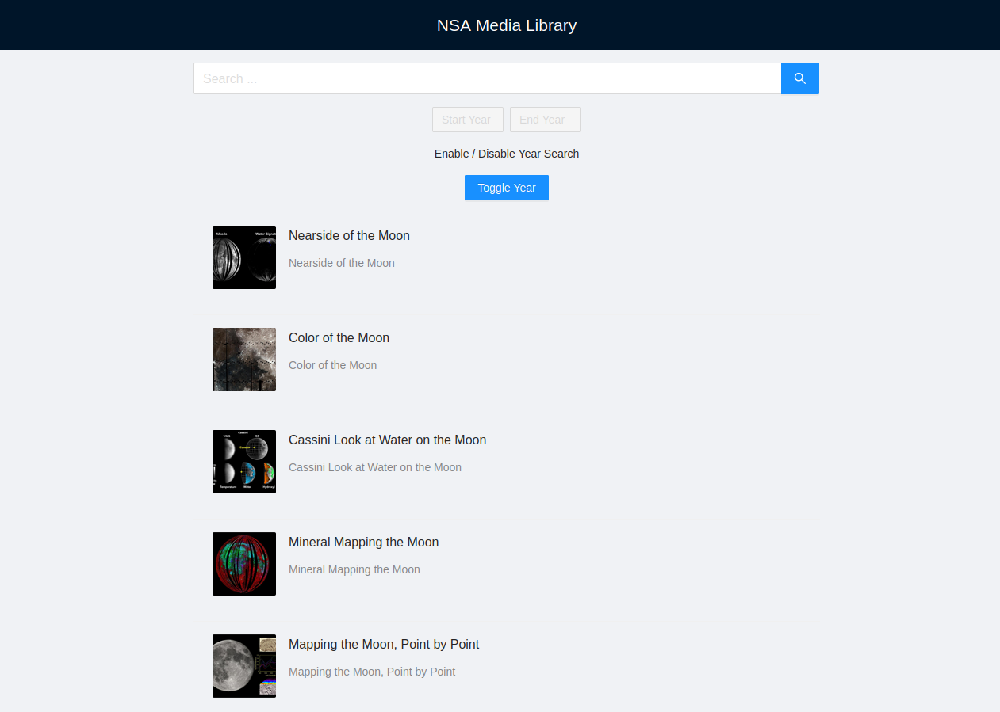

# Nasa Image Library

An application created by React for viewing and searching NASA media library.



## Packages

- react, typescript, react-router-dom
- antd, react-query, axios
- eslint, prettier, jest, @testing-library/react

## Installation

App requires [Node.js](https://nodejs.org/) v14+ to run.

Install the dependencies and start the project.

```sh
cd project
npm i
npm run start
```

#

## How to use

### For access the api:

1- please enter endpoint name of the api
2- rename `.env.sample` file to `.env` in project  
3- write url address in the `.env` file and save it

```sh
REACT_APP_APP_URL=https://images-api.nasa.gov
```

4- run the project

```sh
npm run start
```

5- for run test

```sh
npm run test
```

6- for production

```sh
npm run build
```

\* if you want to use docker for running the app use the below command on termial

```sh
docker compose up
```

### Thanks

Thank you for your consideration and I hope to join your team soon :)  
here are my <mehdi.kindly@gmail.com> and [website](https://www.mahdifalamarzi.info).
